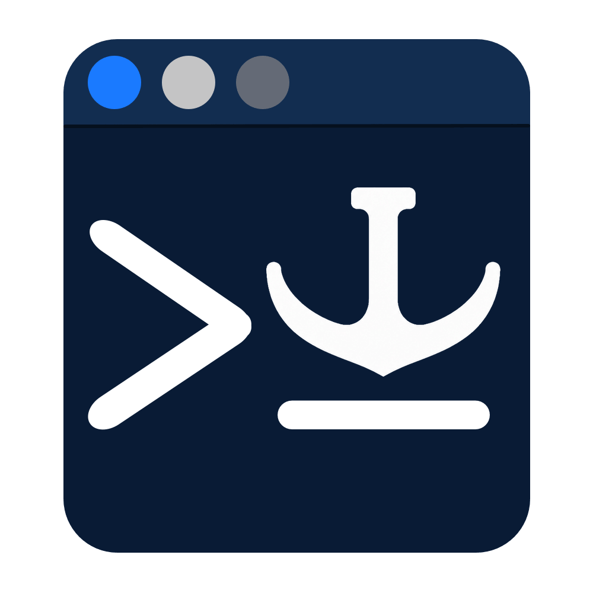
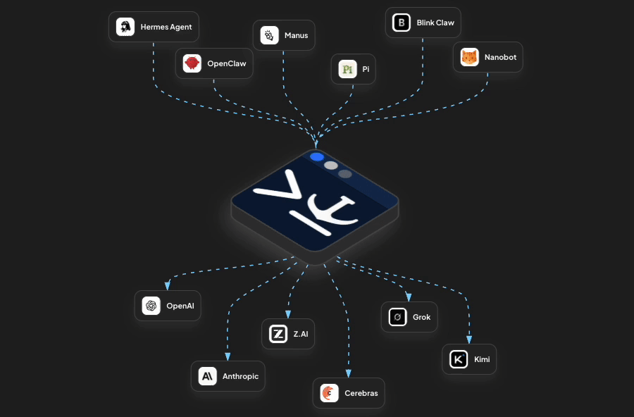

<!-- @format -->

<p align="center">
  <picture>
    <source media="(prefers-color-scheme: dark)" srcset="web/public/anchorshell-logo-dark.png">
    
  </picture>
</p>

<h1 align="center">AnchorShell Relay</h1>

<p align="center">
  <strong>Fast. Flexible. Intuitive. An AI gateway built for agents — and the people behind them.</strong>
</p>

<p align="center">
  Go backend. Nuxt frontend. Compiled for your platform, packaged in one application binary.
</p>

<p align="center">
  <a href="go.mod"></a>
  <a href="docs/openapi.json"></a>
  <a href="https://anchorshell.com/docs/self-hosting"></a>
  <a href="LICENSE"></a>
</p>

<p align="center">
  <a href="https://anchorshell.com">Website</a> ·
  <a href="https://anchorshell.com/docs/getting-started">Docs</a> ·
  <a href="https://app.anchorshell.com">Hosted Relay</a> ·
  <a href="#community">Community</a>
</p>

<p align="center">
  
</p>

## What is Relay?

**Stop hard-coding your app to one model. One API. Any model. Smarter routing. Built for agents from day one. Built for smart classification with system one models, such as Jev and Laya. Now ships with Laya.**

Relay sits between your app and your models. Connect OpenAI, Anthropic, Bedrock, Vertex AI, Groq, Together AI, Fireworks, Ollama, LM Studio, and more — then route everything through one API.

Use a model directly, put models into Groups, or let Relay wait for the model you actually want instead of instantly falling back to whatever happens to have spare capacity.

Relay gives you routing, queueing, pacing & model cooldowns, fallbacks, guardrails, limits, usage tracking, cost tracking, logs, and a realtime view of every request.

**Protect quality when traffic spikes.** Relay paces requests so you do not blow past provider RPM and token limits, absorbs bursts with queue-first routing, and keeps preferred models in play instead of immediately dropping to weaker backups.

Run it yourself with no separate database or queue to manage. Relay ships as a single Go application with the dashboard built in.

**Need smarter routing?** Community Edition can classify requests and use that context with its available routing capabilities. Hosted Relay adds stronger request classification and Smart Groups that route automatically based on intent, domain, complexity, and your configured model assignments.

**100+ providers. Tens of thousands of models. One place to manage them.**

[Get started](#quick-start) · [Read the docs](https://anchorshell.com/docs) · [Try hosted Relay](https://anchorshell.com/)

## Quick start

Requires Git, Make, Go 1.26.4 or a newer Go 1.26 patch, and Node.js 22.19.0 with npm.

### Build from source

<!-- LAUNCH CHECK: Confirm the configured GitHub repository is publicly accessible before announcing this quick start. -->

```bash
git clone https://github.com/anchorshell/relay.git anchorshell-relay
cd anchorshell-relay
make deps
make install-dev-tools
make dev
```

Open **[localhost:3030](http://localhost:3030)** for the dashboard and sign in with
the `RELAY_ADMIN_TOKEN` printed in your terminal. `make dev` starts the frontend
and backend with hot reload.

- **Dashboard:** `http://localhost:3030` — open this in your browser.
- **Backend API:** `http://localhost:11730` — use this in curl and API clients.
- **Realtime:** `ws://localhost:11730/api/ws` — shares the backend port.

On first startup, Relay creates `.env` and prints newly generated credentials once:

- `RELAY_ADMIN_TOKEN`: dashboard and management access.
- `RELAY_API_TOKEN`: inference requests from your applications.
- `RELAY_MASTER_KEY`: encryption for stored provider credentials.

Local data is stored in `relay.db`. Keep `.env` private and back up the master key.
Inference authentication is enabled by default; the admin token does not authorize inference.
See the [self-hosting guide](https://anchorshell.com/docs/self-hosting) for configuration.

Use HTTPS and appropriate network restrictions when deploying beyond local development.

## First request

In **Providers**, add a compatible provider and its credential, then enable a model.
Optionally add it to a **Group** to configure ordered fallback models.

Replace `<MODEL_OR_GROUP>` with your configured group name or `provider/model` target.
Replace `<RELAY_API_TOKEN>` with the inference token from your local `.env`.

```bash
curl -X POST http://localhost:11730/v1/chat/completions \
  -H 'Authorization: Bearer <RELAY_API_TOKEN>' \
  -H 'Content-Type: application/json' \
  -d '{
    "model": "<MODEL_OR_GROUP>",
    "messages": [
      {
        "role": "user",
        "content": "Hello from Relay"
      }
    ]
  }'
```

A successful request returns an OpenAI-compatible chat completion.
Or open **Playground** in the dashboard and enter your Relay API token there.

## Run Laya locally (optional)

Community Edition can use **Laya** to classify request intent and identify coding
tasks locally. The built-in AnchorShell Classifier remains the default; Laya is
an optional, separate worker.

You need **Python 3.11–3.13**, **uv**, and enough disk space and memory for the
model and its PyTorch runtime. See the [Laya setup guide](docs/LAYA.md) for
platform requirements and existing Python environment options.

From the repository root, run the one-time setup:

```bash
make laya-setup
```

**First-time setup downloads the Python dependencies and pinned Laya model.**
Allow time for the download. The model is cached locally; it is not downloaded
again on each startup. Startup requires setup to have completed successfully.

Start the worker in a separate terminal and leave it running:

```bash
make laya-start
```

The worker loads and warms the cached model, then serves on
`http://127.0.0.1:11731`. CPU is the default. Classification runs locally;
startup and serving do not download models.

Add these settings to Community Relay's own `.env`:

```dotenv
RELAY_LAYA_URL=http://127.0.0.1:11731
RELAY_LAYA_TIMEOUT=2s
```

The timeout is an example; adjust it for your hardware and workload. Restart
Relay's backend to load these settings, then select **Laya** under
**Settings → Request Characterization** and click **Save**. If the worker is
unavailable, Relay falls back to AnchorShell classification for that request
without changing your saved selection.

Keep the worker private—applications send requests to Relay, not directly to
Laya. See the [Laya guide](docs/LAYA.md) for authentication, the fast routing
contract, and explicit full-characterization options.

## Features

- **Agentic-first** — route, pace, guard, and observe model calls from agents, workflows, and applications through the same infrastructure.
- **One API across providers** — connect cloud providers and locally served models through OpenAI-compatible APIs.
- **Queue-first routing** — absorb bursts, pace requests, and wait for preferred-model capacity within your wait budget.
- **Groups and fallbacks** — put several models behind one name and control the order Relay tries them.
- **Automatic request categorization** — inspect task intent, domain, and complexity with the built-in AnchorShell Classifier or an [optional local Laya worker](docs/LAYA.md).
- **Resource limits** — keep shared capacity and spend in check with request, token, cost, and concurrency limits.
- **Guardrails against data leaks** — connect pre-dispatch checks to help block sensitive prompts and post-response checks to inspect output.
- **Usage and cost tracking** — see where tokens and money go using configured model prices.
- **Logs and realtime** — watch requests move through queues and models, then inspect what happened.
- **Playground** — try requests in the dashboard and copy the matching curl command into your client workflow.
- **Encrypted credentials** — store provider secrets once, protected with AES-256-GCM, instead of sharing them with every client.

See the [full documentation](https://anchorshell.com/docs/getting-started) for details.

## How it works

Your app talks to Relay through one OpenAI-compatible API. Relay handles routing, capacity, fallbacks, guardrails, and visibility before the request reaches a model.

```text
                         Your application
                                │
                                │  OpenAI-compatible API
                                ▼
                  ┌───────────────────────────┐
                  │     AnchorShell Relay     │
                  │                           │
                  │  Route                    │
                  │    ↓                      │
                  │  Queue + Pace             │
                  │    ↓                      │
                  │  Guard                    │
                  │    ↓                      │
                  │  Track                    │
                  └─────────────┬─────────────┘
                                │
                ┌───────────────┼───────────────┐
                ▼               ▼               ▼
             OpenAI         Anthropic       Local models
             Bedrock        Vertex AI       Ollama / vLLM
             Groq           Together        LM Studio / etc.
```

**You choose the target. Relay handles the traffic.**

Send requests directly to a model or use a Group to keep preferred models in play. Relay queues and paces requests against provider limits, waits for capacity, falls back when needed, and records usage, cost, logs, and realtime activity along the way.

Provider credentials stay in Relay instead of being copied into every application.

[Provider setup →](https://anchorshell.com/docs/providers) · [Groups →](https://anchorshell.com/docs/groups) · [How routing works →](https://anchorshell.com/guides/tune-wait-pacing-cooldowns)

Relay connects to OpenAI-compatible cloud and local model endpoints. See the [Providers documentation](https://anchorshell.com/docs/providers) for provider-specific setup and compatibility notes.

## Self-hosted vs hosted

| Capability                                | Self-host Relay | AnchorShell Hosted |
| ----------------------------------------- | :-------------: | :----------------: |
| Queueing                                  |       ✅        |         ✅         |
| Request pacing                            |       ✅        |         ✅         |
| Groups and fallback routing               |       ✅        |         ✅         |
| Smart Groups                              |        —        |         ✅         |
| API key providers                         |       ✅        |         ✅         |
| Supported OAuth provider connections      |        —        |         ✅         |
| Guardrails                                |       ✅        |         ✅         |
| Provider and resource limits              |       ✅        |         ✅         |
| Logs and traces                           |       ✅        |         ✅         |
| Realtime monitoring                       |       ✅        |         ✅         |
| Basic request classification              |       ✅        |         ✅         |
| System One Classification (Jev, Laya)     |       ✅        |         ✅         |
| System One Routing (Pro)                  |        —        |         ✅         |
| Advanced (Pro) request classification     |        —        |         ✅         |
| Smart routing based on Pro classification |        —        |         ✅         |
| Teams and invitations                     |        —        |         ✅         |
| Per-user limits and budgets               |        —        |         ✅         |
| Per-API-key limits and budgets            |        —        |         ✅         |
| Usage and analytics                       |       ✅        |         ✅         |
| Managed API keys                          |        —        |         ✅         |
| Operate on your infrastructure            |       ✅        |         —          |
| Managed infrastructure                    |        —        |         ✅         |

Hosted Relay includes a free tier. Features and capacity depend on the plan;
model-provider charges remain separate.

Want Relay without operating it yourself? [Explore hosted Relay →](https://anchorshell.com/pricing)

## Documentation

<!-- These published documentation URLs remain supported by redirects when the new docs tree is deployed. -->

- [Getting started](https://anchorshell.com/docs/getting-started)
- [Self-hosting and configuration](https://anchorshell.com/docs/self-hosting)
- [Providers](https://anchorshell.com/docs/providers-and-endpoints)
- [Provider compatibility reference](docs/PROVIDER_COMPATIBILITY.md)
- [Groups and fallbacks](https://anchorshell.com/docs/routing-lanes-and-fallbacks)
- [Limits and guardrails](https://anchorshell.com/docs/limits-and-guardrails)
- [API reference](https://anchorshell.com/docs/api-reference)

## Community

Questions, bug reports, or feature ideas? [Contact AnchorShell](https://anchorshell.com/contact).
For sensitive reports, use the [security reporting guide](https://anchorshell.com/security).

<!-- TODO BEFORE LAUNCH: Add the official Discord invite after the server is ready. -->
<!-- TODO BEFORE LAUNCH: Confirm public Issues at https://github.com/anchorshell/relay/issues, then link bug reports and feature requests. -->
<!-- TODO BEFORE LAUNCH: Enable and verify GitHub Discussions before adding a link. -->

## Contributing

Contributions to code, tests, and documentation are welcome.
See [CONTRIBUTING.md](CONTRIBUTING.md) for local setup, checks, and pull-request guidance.

<!-- TODO BEFORE ACCEPTING EXTERNAL PRs: Confirm and publish the contribution/CLA process. No CLA is currently specified. -->

## Contributors

Thank you to everyone who helps improve Relay.

<!-- TODO AFTER PUBLIC LAUNCH: Link https://github.com/anchorshell/relay/graphs/contributors once publicly accessible. Add an avatar wall only when useful; no external image dependency is required. -->

<!--
STAR HISTORY — TODO AFTER LAUNCH:
Add a chart when the repository has enough history to make it useful.
Prefer a reviewed workflow generating local docs/assets/star-history-light.svg
and docs/assets/star-history-dark.svg. Do not embed a chart before it exists.
-->

## License

Relay Community Edition is source available under the
[AnchorShell Relay Community License 1.0](LICENSE).
Free for personal/noncommercial use and qualifying small businesses, subject to
the license terms. Other commercial use requires a separate license.

See [LICENSE](LICENSE) for the full terms or [contact AnchorShell](https://anchorshell.com/contact)
about commercial licensing.
